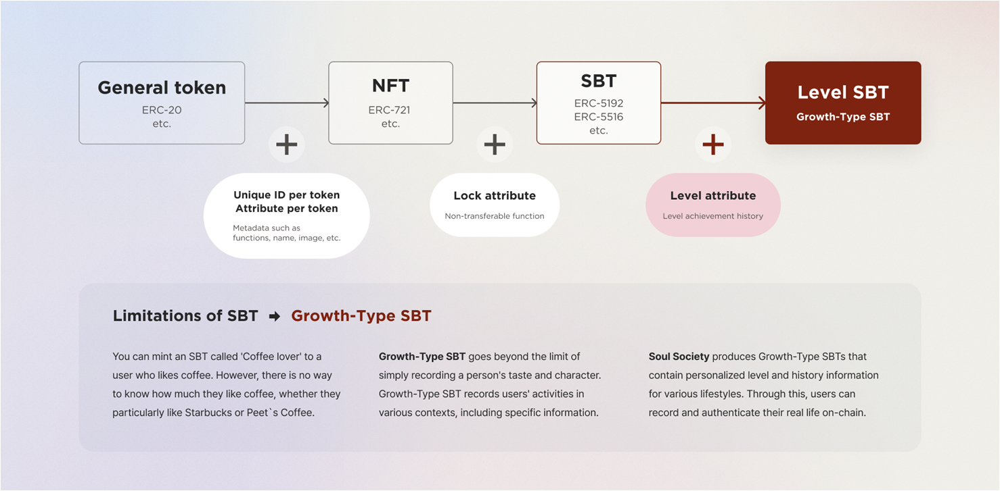
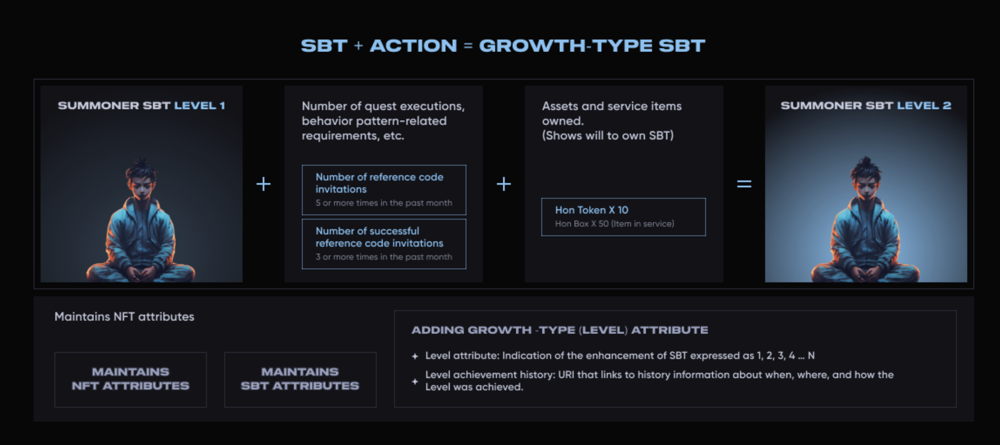
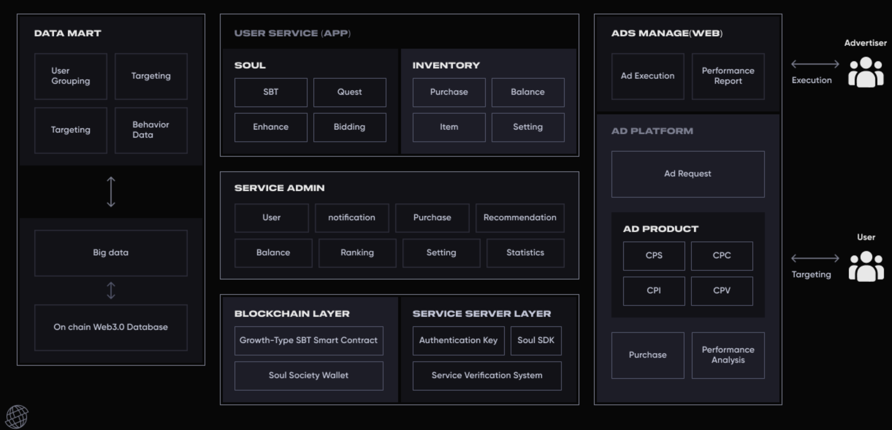

# soulsociety-sbt-contract

### Environment
- Ethereum Smart Contract
- Build with Remix IDE https://remix.ethereum.org

### Contract Versions
- V1 SBT Contract that supports all functions
- V2 Lightweight SBT Contract for reduced gas fees

## Table of Contents
- [What's SBT?](#whats-sbt)
- [What’s Growth-Type SBT?](#whats-levelgrowth-type-sbt)
- [What's SoulSociety?](#whats-soulsociety)
- [SoulSociety Service ](#soulsociety-service)
- [Community](#Community)
- [Resources](#Resources)

## What's SBT?
Soulbound Token은 NFT에 Lock 속성을 통해 Transfer(전송) 기능을 제거한 토큰을 말한다.
개인에게 속한 고유의 정보를 저장하거나 증명하기 위한 용도로 사용하기 좋다.
사용 사례로는 ID 인증, 주요 개인 정보 저장(학위 인증, 학력 인증) 등 개인에게 속한 정보이며, 전송 기능이 필요하지 않고 전송되서도 안되는 정보들을 다루는데 유효하게 사용 가능하다.

## What's Growth-Type SBT?


SBT 는 기본 정보는 포함할 수 있으되, 좀 더 디테일한 속성을 표현하기 어려운 점이 있다.

예를 들어보자, 커피를 좋아하는 A에게 커피매니아라는 SBT가 발행된 경우, 우리는 그 A가 커피를 얼마나 좋아하는지, 특별히 스타벅스를 좋아하는지 커피빈을 좋아하는지 알 수 있는 기본적인 방법이 없다. 개인의 이력 및 캐릭터를 SBT로 표현하는 것은 적절했지만, 얼마나, 어떻게, 언제부터, 무엇을 좋아하는지에 대한 디테일 정보까지 알 수 있어야 진정한 Real Life를 표현할 수 있는데 더 적절할 것이다.
성장형 SBT는 추가적인 Growth-Type 정보 및 히스토리 정보가 담겨있는 SBT를 통해, 좀 더 Real Life를 담아낼 수 있는 구조를 가지고 있다.

- Growth-Type SBT 는 소울 바운드 토큰을 기반으로 SBT의  Growth-Type 및 Growth 달성 timestamp를 기록한 SBT이다.
````
- 성장형(Growth-Type) 속성 추가 
  - Growth-Type 속성 : 1, 2, 3 ,4 … N 으로 표현되는 SBT의 강도 표시 
  - Growth-Type 달성 히스토리 : 언제, 어떻게, 무엇을 통해 Growth-Type을 달성했는지 히스토리 정보 및 히스토리 정보 연결 URI
````




## What's SoulSociety?
- 소울 소사이어티는 성장형 SBT 컨트랙트 발행 회사이며, 이를 이용한 서비스를 운영하고 있다.
- 소울 소사이어티는 성장형 SBT를 유저에게 발행해주는 플랫폼이다.
- 소울 소사이어티가 제공하는 서비스를 통해 유저는 자연스럽게 다양한 활동을 하게 되고, 자신의 아이덴티티를 정의할 수 있는 많은 SBT를 발행받고 소유하게 된다.
- 소울 소사이어티를 통해 필연적으로 비슷한(같은) 카테고리의 SBT 발행유저들이 생겨나며, 이를 통해 자연스럽게 소셜서비스를 제공한다.
- 소울 소사이어티를 통해 발행되는 SBT는 누구에게나 조회가 가능하며, 이를 통해 다양한 서드파티 서비스에 적용할 수 있다.

````
- SBT 기반 Real 지식인 서비스 : 캠핑왕, 야구왕, 골프왕, 바이크 고수.. 등등등
- Ad Target 플랫폼 : SBT는 지갑에 발행되기 때문에 그 리얼 유저들에게 접근할 수 있는 방법은 제한적이다. 소울 소사이어티 서비스를 이용하면 SBT 들을 소유한 유저들에게 최적의 타겟 마케팅을 할 수 있다 
- SBT 기반 카페 서비스, 모임 서비스, 커뮤니티 서비스
````

## SoulSociety Service


# Community
- [Homepage](https://www.soulsociety.gg) is the official HomePage 
- [Discord](https://discord.com/invite/adpF7Hz323) is SoulSociety's official Discord channel
- [Telegram](https://soulsociety.medium.com/) is the Telegram channel for soul-society community userss.

# Resources
- [Medium](https://soulsociety.medium.com/) soulsociety's official technical articles are published there.
