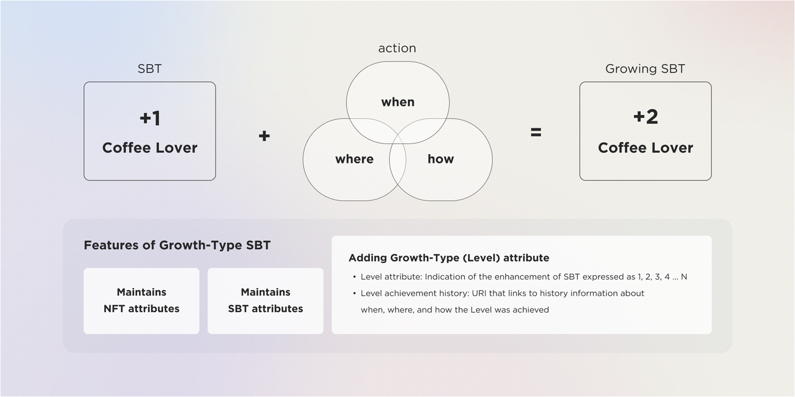
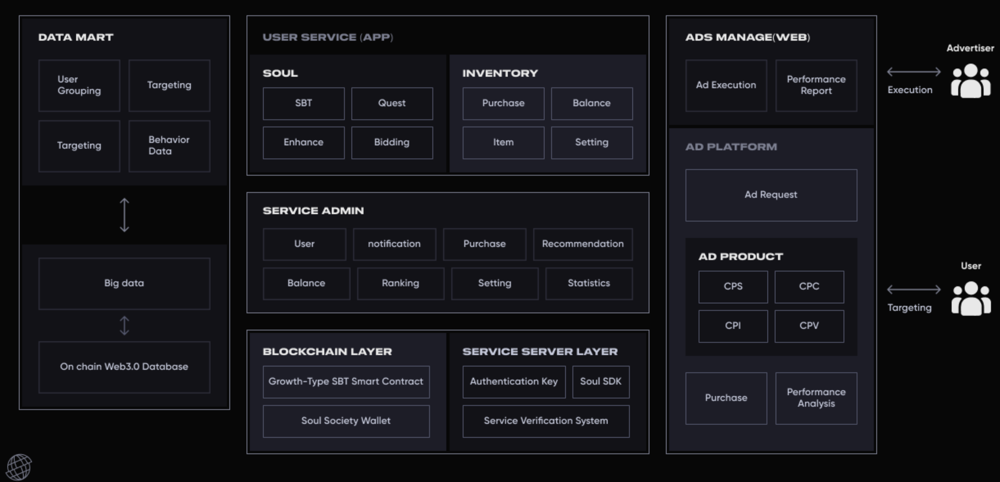

# soulsociety-sbt-contract

## Environment
- Ethereum Smart Contract
- Solidity : 0.8.20
- Build with Foundry Framework 

## Contract List
- hon : [ERC20 Hon Token](hon-contract/src/HonContract.sol)
- sbt : [SBT Contract for SoulSociety Service](sbt-contract/src/SoulSocietySBT.sol)
- sbt-quest : [SBT Quest Contract for SoulSociety Service](sbt-quest-contract/src/SoulSBTQuest.sol)

## Table of Contents
- [What's SBT?](#whats-sbt)
- [What’s Growth-Type SBT?](#whats-levelgrowth-type-sbt)
- [What's SoulSociety?](#whats-soulsociety)
- [SoulSociety Service ](#soulsociety-service)
- [Community](#Community)
- [Resources](#Resources)

## Technical Specifications 
- [Hon Token Contact](HonTechSpec.md)
- [SBT Hon Contract](SbtHonTechSpec.md)

## Token Contract
- [Hon Token](https://etherscan.io/token/0xebdb54e76bfec9ab4e06ccf6e484e4126f81befc)
- [SBT Token](https://nova.arbiscan.io/token/0xea7c0d4e262cce5d34492e4879facc6f8d5c74aa)
- [SBT Quest Token](https://nova.arbiscan.io/address/0xea7c0d4e262cce5d34492e4879facc6f8d5c74aa)

## Environment Configurations
- [HonContract Develop & Deploy](./hon-contract/README.md) 
- [SBT HonContract Develop & Deploy](./sbt-contract/README.md)

## What's SBT?
A Soulbound Token refers to a specific type of NFT where the Transfer function has been
removed through the Lock attribute. It is ideal for storing or proving unique information
that   belongs   to   an   individual.   It   can   be   used   effectively   to   handle   information   that   is
owned   by   individuals,   such   as   ID   authentication,   storage   of   key   personal   information
(degree certification, academic certification), and information that does not need to be
transferred and should not be transferred

## What's Growth-Type SBT?


While   SBT   can   contain   basic   information,   they   have   limitations   in   representing   more
detailed attributes.
For example, consider a person A who loves coffee and has minted an SBT titled "Coffee
Lover". We have no fundamental way of knowing how much A loves coffee, or whether A
particularly likes Starbucks or Coffee Bean. SBT is well-suited for expressing a person's
history and character, but it has limitations when it comes to storing detailed information
that can express a true real life, such as what they like, how much they like it, how they
like it, and when they started liking it. Growth-Type SBT is structured to encapsulate more
of Real Life by containing these additional pieces of information

- Growth-Type SBT is an Soulbound Tokens which records theGrowth-Type(level) attribute and level achievement history of the SBT
````
- Adding Growth-Type(Level) attribute 
  - Growth-Type Attribute :  Indication of the enhancement of SBT expressed as 1, 2, 3, 4 ... N 
  - Growth-Type achievement history: URI that links to history information about when,where, and how the Level was achieved
````



## What's SoulSociety?
- Soul Society is a company that mints Growth-Type SBT contracts and operates  services using them. 
- Soul Society is a platform that mints Growth-Type SBTs to its users 
- Through the services provided by Soul Society, users naturally engage in a variety of activities and acquire many SBTs that can define their identities. 
- In Soul Society, users who mint SBT in similar (or same) categories are created inevitably, and through this, we provide social service naturally. 
- The SBT minted through Soul Society can be viewed by anyone and can be applied to various third-party services

````
- True Knowledge Services Based on SBT: Camping King, Baseball King, Golf King, Bike Expert... etc.
- Ad Target Platform: As SBT is issued in wallets, the methods to access these real users are limited. By using Soul Society service, optimal target marketing can be executed to users who possess SBT.
- SBT-Based Cafe Service, Gathering Service, Community Service
````

## SoulSociety Service


## App Download Link
- [iOS Download](https://apps.apple.com/us/app/soulsociety/id6450750026)
- [Android Download](https://play.google.com/store/apps/details?id=io.soulsociety.app)

# Community
- [Homepage](https://www.soulsociety.gg) is the official HomePage
- [Discord](https://discord.com/invite/adpF7Hz323) is SoulSociety's official Discord channel
- [Telegram](https://soulsociety.medium.com/) is the Telegram channel for soul-society community userss.

# Resources
- [Medium](https://soulsociety.medium.com/) soulsociety's official technical articles are published there.


